# TheGabebook

**TheGabebook** is a social platform built with vanilla HTML, CSS, JavaScript, Node/Express.js, [MVC](https://en.wikipedia.org/wiki/Model%E2%80%93view%E2%80%93controller) architecture, [RESTful](https://en.wikipedia.org/wiki/REST) APIs, and [AWS](https://en.wikipedia.org/wiki/Amazon_Web_Services) hosting.

It includes profiles, posting, friendships, messaging, commenting, liking, and notifications.

  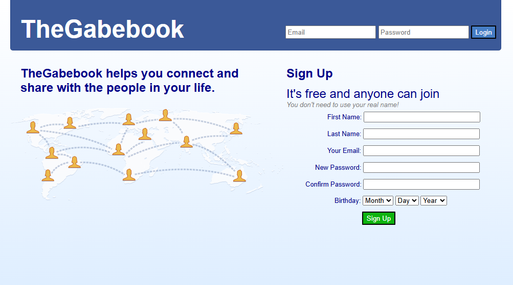

---

## MVC Architecture

MVC was used to keep the project organized, modular, and extensible through a clear separation of concerns. Node/Express.js makes it easy to create routes, controllers, and models to support this design.

  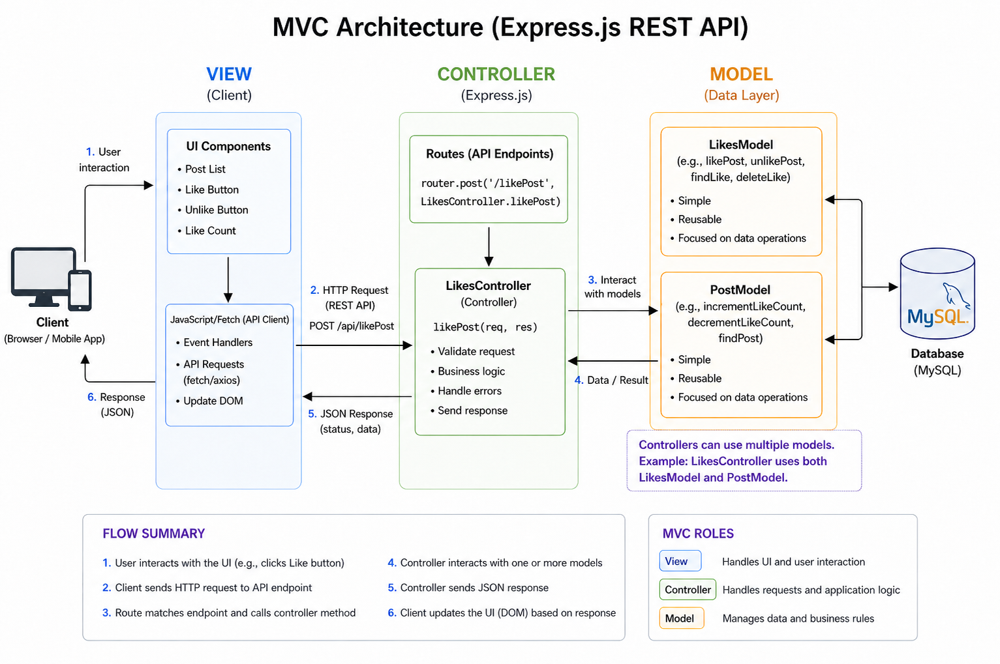

---

## Example: Liking a Post

The `/likePost` API is triggered by a client-side UI interaction:

  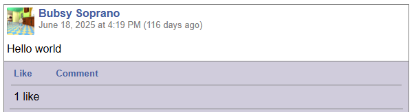

| Client (View) | Server (Controller) |
|---------------|--------------------|
| On the client side, the post view includes a like button that sends a request to the endpoint.     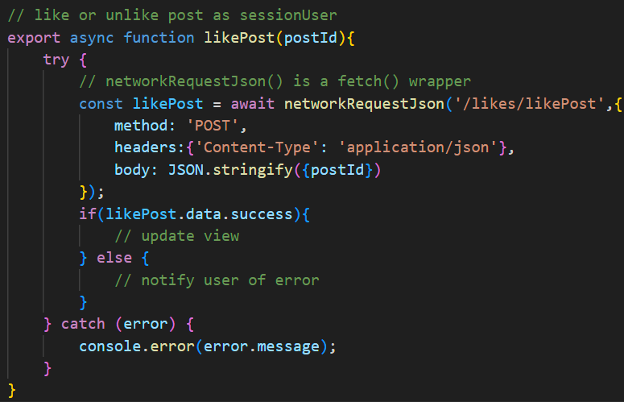 | The Express router maps the endpoint to a controller method, which interacts with models.    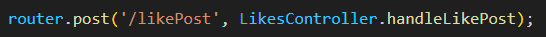 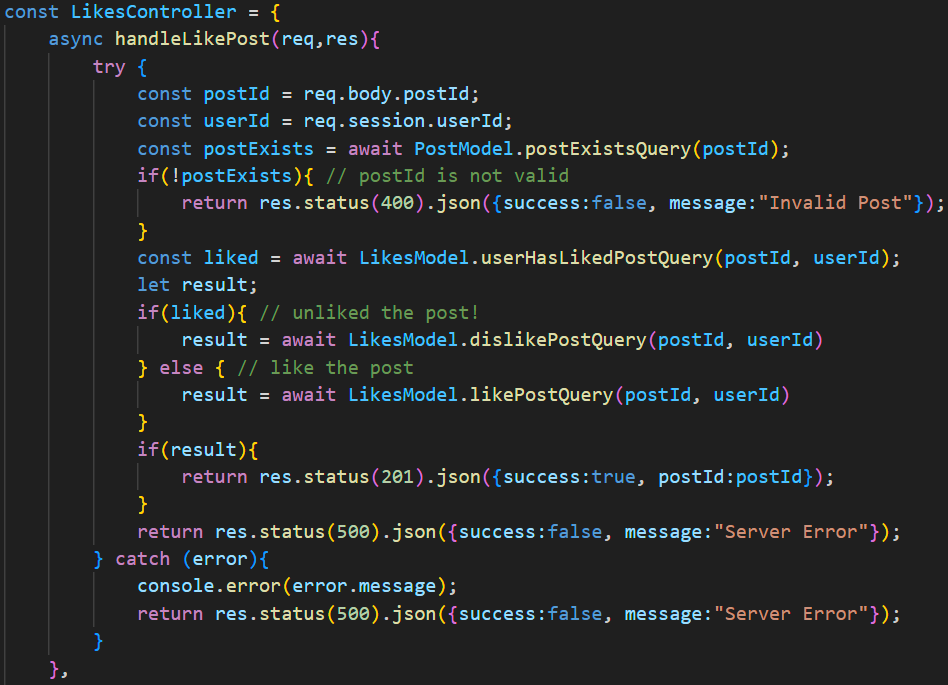 |

Once the response is received, the client updates the view by modifying [DOM](https://en.wikipedia.org/wiki/Document_Object_Model) elements.

  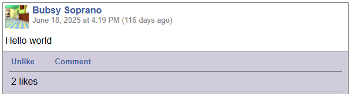

---

## Model Design

Controllers are not limited to a single model. For example, the `LikesController's` `handleLikePost` uses both the `LikesModel` and `PostModel`. Model methods are kept intentionally simple and reusable to improve extensibility.

  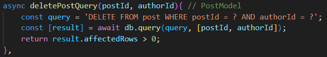
   
  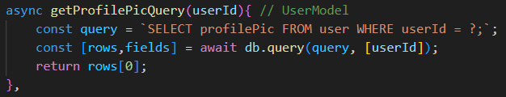

---

## Additional MVC Examples

Most user-facing features (profiles, posts, comments, etc.) follow the same MVC pattern.

  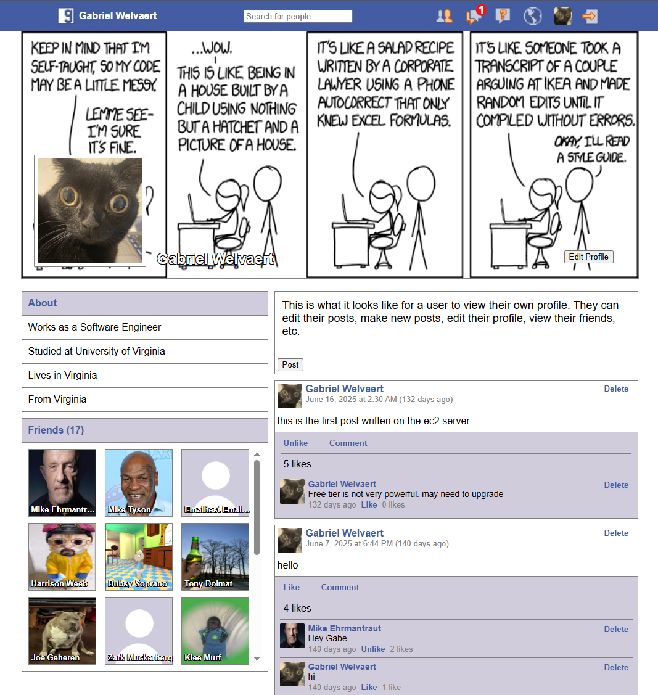

---

## Authentication

Session-based authentication is implemented using the [express-session](https://expressjs.com/en/resources/middleware/session.html) middleware.

  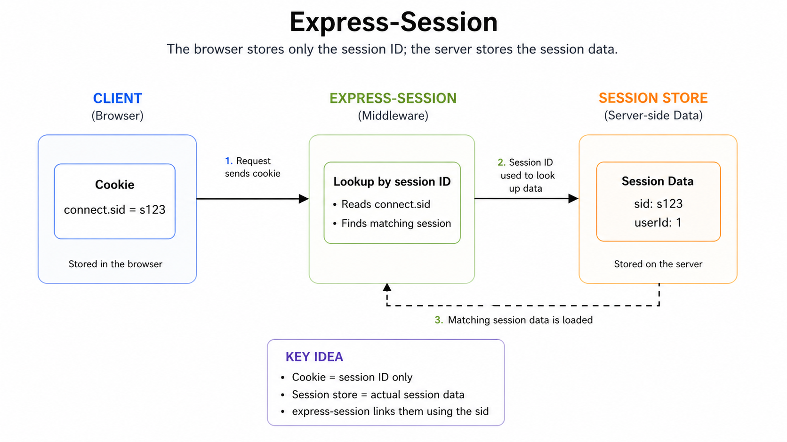

This allows for easy identification of users during requests:

  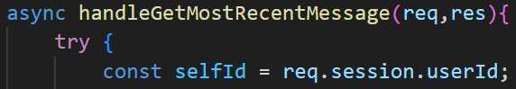

---

## Authorization

Authorization is enforced using a friendship check before processing inter-user requests. This is implemented as reusable middleware.

### validateFriendship middleware

  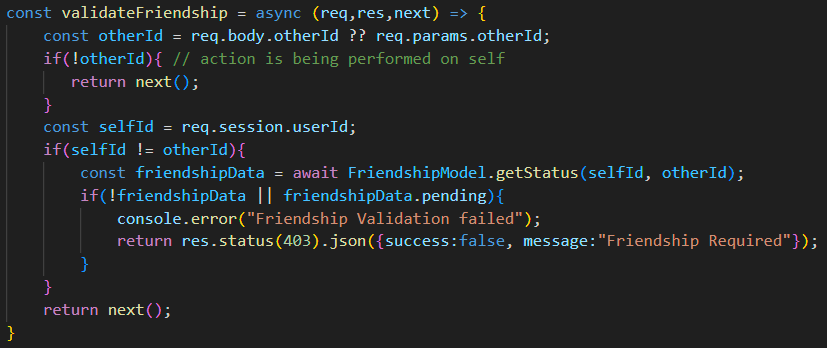

Middleware is applied to routes and runs before controllers, allowing early rejection of unauthorized requests

  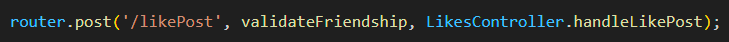

---

## Security

### CSRF Protection

Implemented using [csurf](https://www.npmjs.com/package/csurf) middleware.

- Stores a per-client secret in a cookie
- Requires a token for POST requests

  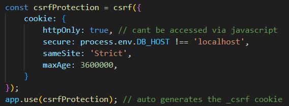

| Token Issuance | Token Usage |
|----------------|-------------|
| 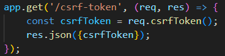 | 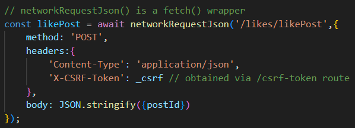 |

  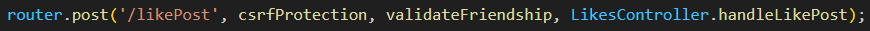

---

### Additional Protections

| SQL Injection | XSS |
|--------------|-----|
| Parameterized queries prevent query manipulation.     | The [xss](https://www.npmjs.com/package/xss?activeTab=dependents) package sanitizes input.    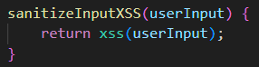 |

---

## Real-Time Features

Real-time notifications and messaging are implemented using WebSockets via [Socket.io](https://socket.io/).

### Messaging Example

  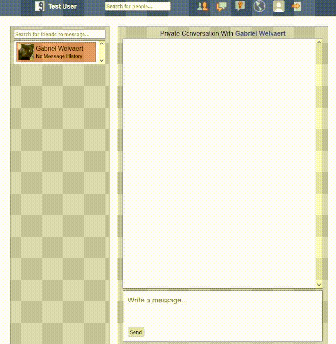

